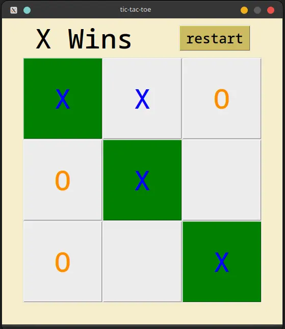
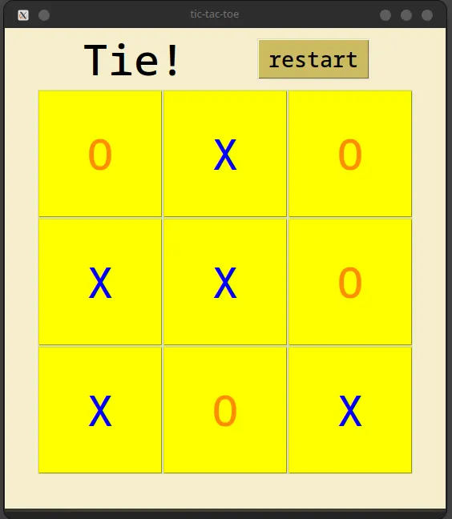

# Tic-Tac-Toe Game

This is a simple implementation of the classic Tic-Tac-Toe game using Python and Tkinter.

## Description

Tic-Tac-Toe is a two-player game where players take turns marking spaces in a 3x3 grid with their designated symbol (usually X or O). The player who succeeds in placing three of their marks in a horizontal, vertical, or diagonal row wins the game. If the grid is filled without any player achieving three in a row, the game is considered a draw.

<div style="text-align:center">
     
</div>

## Features

- Player vs Player mode.
- Restart game functionality.
- Highlighting winning rows, columns, or diagonals.
- Indicating a tie game.

## Requirements

- Python 3.x
- Tkinter (usually comes pre-installed with Python)

## Installation

Clone the repository:

```bash
git clone https://github.com/Wayfarerdesert/ticTacToe.git
```

## Navigate to the project directory

`cd ticTacToe`

### Run the game:

`python main.py`
